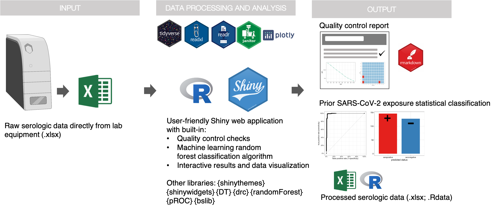
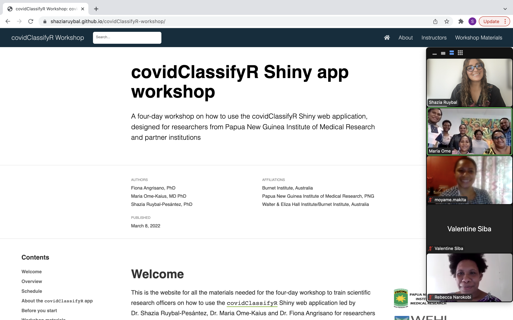

```{r setup, include=FALSE}
options(htmltools.dir.version = FALSE)
knitr::opts_chunk$set(
  fig.width=9, fig.height=3.5, fig.retina=3,
  out.width = "100%",
  cache = FALSE,
  echo = TRUE,
  message = FALSE, 
  warning = FALSE,
  hiline = TRUE
)

library(xaringanthemer)
library(xaringanExtra)
library(showtext)
library(fontawesome)
library(metathis)
library(readxl)
library(kableExtra)
```

```{r xaringan-themer, include=FALSE, warning=FALSE}
# style_duo_accent(
#   primary_color = "#002E5E", 
#   secondary_color = "#D50032",  #FF0000
#   inverse_header_color = "#7B859B"
# )

style_duo_accent(
  primary_color = "#4d72be",
  secondary_color = "#4baa8f",
  inverse_header_color = "#FFFFFF",  
  header_color = "#4d72be", 
  code_highlight_color = "#ab9df8",
  code_inline_color = "#ab9df8",
  text_color = "#3d3d3d", 
  link_color = "#ab9df8", 
  inverse_link_color =  "#ab9df8" # ,
  # header_font_google = google_font("Roboto"),
  # text_font_google   = google_font("News Cycle", "300", "300i"),
  # code_font_google   = google_font("Fira Mono")
)
```

```{r xaringan-extras, echo=FALSE}
xaringanExtra::use_webcam()
```

```{r metathis, echo=FALSE}
meta() %>%
  meta_name("github-repo" = "shaziaruybal/covidClassifyR_useR2022") %>% 
  meta_social(
    title = "covidClassifyR a Shiny app to streamline COVID-19 data analysis pipleines",
    description = paste(
      "covidClassifyR: a Shiny app to streamline data analysis pipelines to enhance the monitoring of COVID-19 in Papua New Guinea"
    ),
    url = "https://shaziaruybal.github.io/covidClassifyR_useR2022/covidClassifyR_useR2022.html",
    image = "https://shaziaruybal.github.io/covidClassifyR_useR2022/img/social-share-card.png",
    image_alt = paste(
      "Title slide of covidClassifyR: a Shiny app to streamline data analysis pipelines to enhance the monitoring of COVID-19 in Papua New Guinea"
    ),
    og_type = "website",
    og_author = "Shazia Ruybal-Pesántez",
    twitter_card_type = "summary_large_image",
    twitter_creator = "@DrShaziaRuybal",
    twitter_site = "@DrShaziaRuybal"
  )
```

class: middle, center

background-image: url(img/logos_burnet_WEHI.png)
background-position: bottom center
background-size: 90%

###  `r rmarkdown::metadata$title`

#### **`r rmarkdown::metadata$author`**  
`r rmarkdown::metadata$institute`

#### `r rmarkdown::metadata$date`

*Presented at the useR 2022 conference*

[`r fa(name = "github")` @shaziaruybal](http://github.com/shaziaruybal)  
[`r fa(name = "link")` shaziaruybal.com](https://shaziaruybal.com)  
[`r fa(name = "twitter")` @DrShaziaRuybal](http://twitter.com/DrShaziaRuybal)  
[`r fa(name = "paper-plane")` ruybal.s@wehi.edu.au](mailto:ruybal.s@wehi.edu.au)

---
class: inverse

## `r fa("virus")` COVID-19 serological surveillance

--
### `r fa("search")` Epidemiology strategy testing blood samples for the presence of antibodies against SARS-CoV-2 ("sero-surveillance")

--
### `r fa("network-wired")` Gold standard for measuring population immunity: who has been infected/exposed? Where?

--
### `r fa("medkit")` Useful public health tool in low- and middle-income countries (LMICs) when diagnostic testing is limited

--
### `r fa("vials")` Our team developed a laboratory assay to measure antibodies against SARS-CoV-2 and other respiratory viruses ([Mazhari et al 2021](https://doi.org/10.3390/mps4040072))

---
class: inverse, middle, center

# `r fa("r-project")`

## Why Shiny? 

--

### `r fa("clock")` automates quality control/data processing

--
### `r fa("r-project")` incorporates customized scripts with advanced stats/ML

--
### `r fa("laptop-code")` fit-for-purpose and user-friendly

--
### `r fa("fist-raised")` empowers lab-based researchers 

---
class: top

##  [`covidClassifyR`](https://shaziaruybal.shinyapps.io/covidclassifyr) Shiny web app design 




.footnote[
_Find app at: <br> [shaziaruybal.shinyapps.io/covidClassifyR](https://shaziaruybal.shinyapps.io/covidClassifyR)_
]

---

##  [`covidClassifyR`](https://shaziaruybal.shinyapps.io/covidclassifyr) allows users to: 

--

### `r fontawesome::fa("file-excel")` process raw lab data directly from machine output

--

### `r fontawesome::fa("clipboard")` perform quality control and generate automated report

--

### `r fontawesome::fa("question-circle")` predict exposure to COVID-19 based on the antibody data

--

### `r fontawesome::fa("chart-bar")` visualize data with built-in interactive plots

--

### `r fontawesome::fa("download")` download processed data for further downstream analysis

---
class: inverse, center, middle

# `r fa("magic")` see it in action!

---

<video width="1530" height="600" controls>
  <source src="vid/app_demo.mp4" type="video/mp4"> 
</video>

---

.left-column[
## Hybrid training workshop (March 2022)

🇵🇬 Port Moresby, Papua New Guinea and 🇦🇺 Melbourne, Australia


]

.right-column[

<br>
_Workshop materials at [shaziaruybal.github.io/covidClassifyR-workshop](https://shaziaruybal.github.io/covidClassifyR-workshop) - distill websites are amazing🤩!_


]

---
background-image: url(img/PNG_COVID-19_Seropositivity_map_percents.png)
background-position: bottom
background-size: 65%

###  [`covidClassifyR`](https://shaziaruybal.shinyapps.io/covidclassifyr) in action: mapping COVID-19 in PNG 🇵🇬 

---
class: inverse, middle, center

##  Recap 

--
### `r fa("medkit")` Fit-for-purpose digital tools can enhance COVID-19 sero-surveillance to support public health response efforts

--
### `r fa("laptop-code")` [`covidClassifyR`](https://shaziaruybal.shinyapps.io/covidclassifyr) streamlines pipelines to process and interpret COVID-19 antibody data

--
### `r fa("fist-raised")` Shiny apps can bridge the gap between data generation and data analysis for lab researchers on-the-ground

---
class: top
background-image: url(img/collab_logos.png)
background-position: right, center
background-size: 40%

## Acknowledgments 

.pull-left[
🇦🇺 Dr Fiona Angrisano, Dr Emily Erikkson, Dr Ramin Mazhari, Nick Walker, Prof Ivo Mueller, Prof Leanne Robinson

🇵🇬 Dr Maria Ome-Kaius, Daisy Mantila, Damitha Rakuafery, Tamarah Koleala, Dr Moses Laman

💻 [`covidClassifyR`](https://shaziaruybal.shinyapps.io/covidclassifyr) scripts developed by [Dr Shazia Ruybal-Pesántez](https://twitter.com/drshaziaruybal), with contributions from: Dr Eamon Conway, Dr Connie Li Wan Suen, Dr Narimane Nekkab & Dr Michael White

🙏 A [Regional Collaborations Programme COVID-19 Digital Grant](https://www.science.org.au/news-and-events/news-and-media-releases/regional-research-set-get-digital-boost) supported app dev & workshop

😍 *Hex sticker hot off the press* 

.footnote[
<br>
✨ _[Slides](https://github.com/shaziaruybal/covidClassifyR_useR2022) created with: [*{xaringan}*](https://github.com/yihui/xaringan) & 
[*{xaringanthemer}*](https://github.com/gadenbuie/xaringanthemer)_
]
]
